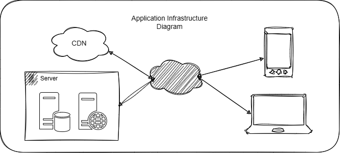
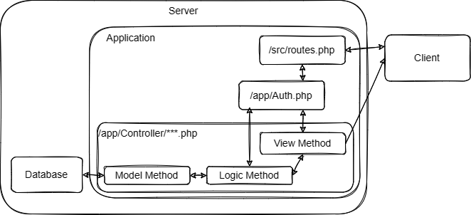
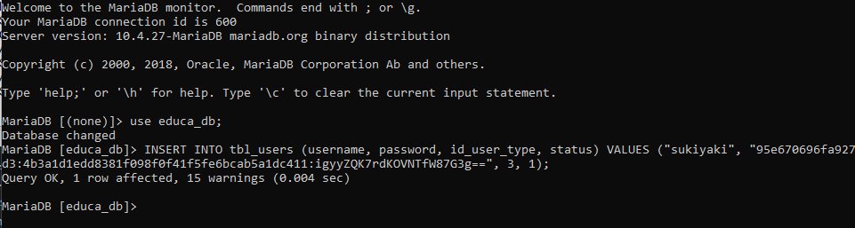
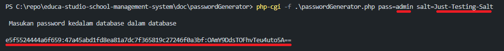

# Educa Studio School Management System

# Overview  

## Daftar Isi  

- [Educa Studio School Management System](#educa-studio-school-management-system)
- [Overview](#overview)
  - [Daftar Isi](#daftar-isi)
  - [Deskripsi](#deskripsi)
  - [Contributor](#contributor)
  - [Main Software Component](#main-software-component)
  - [Known/Possible Bug](#knownpossible-bug)
  - [Struktur File dan Folder](#struktur-file-dan-folder)
  - [Arsitektur Infrastruktur](#arsitektur-infrastruktur)
  - [Arsitektur Aplikasi](#arsitektur-aplikasi)
- [Konfigurasi](#konfigurasi)
  - [File Environment .ENV](#file-environment-env)
  - [Requirement](#requirement)
  - [Deployment](#deployment)
- [Frontend](#frontend)
  - [Fonts](#fonts)
  - [CSS](#css)
  - [JavaScript](#javascript)
- [Route, Api, And Functionality](#route-api-and-functionality)
  - [Default Password  User (Student,Teacher,Parent)](#default-password--user-studentteacherparent)
  - [Menambah User Admin](#menambah-user-admin)
  - [Password Generator](#password-generator)
  - [User Role](#user-role)
  - [View Route](#view-route)
  - [Rest Api Route](#rest-api-route)

## Deskripsi

Ini adalah dokumentasi Singkat Educa Studio School Management System  

## Contributor

- Ahmad Catur Yulianto @CaturSkak
- Miku21 @Miku21750
- Khusanda @Khusanda
- Muhammad Najib RB @najibdani21
- Rizqi Pratama @rizqidev

## Main Software Component

- Slim Framework <https://www.slimframework.com/>
- Medoo <https://medoo.in/>
- Twig <https://twig.symfony.com/>
- Phpmailer <https://github.com/PHPMailer/PHPMailer>
- symfony/dotenv <https://symfony.com/doc/4.1/components/dotenv.html>
- Midtrans <https://github.com/Midtrans/midtrans-php>

## Known/Possible Bug

- Typo Casse Sensitive


## Struktur File dan Folder

| Folder Atau File       | Deskripsi                                                     |
|------------------------|---------------------------------------------------------------|
| app\Controller         | berisi seluruh logic dan model aplikasi                       |
| src\dependencies.php   | berisi deklarasi untuk dependensi                             |
| src\routes.php         | berisi route aplikasi                                         |
| templates              | berisi view yang akan dirender oleh twig                      |
| public                 | berisi file static dan berfungsi sebagai root untuk webserver |
| public\css             | berisi file css static                                        |
| public\fonts           | berisi file font static                                       |
| public\img             | berisi file img static                                        |
| public\js              | berisi file js static                                         |
| public\uploads\Profile | berisi file upload static                                     |
| public\webfonts        | berisi file font static                                       |


## Arsitektur Infrastruktur



*Ubah Diagram diatas di file /doc/diagram/diagram.drawio menggunakan software draw.io

## Arsitektur Aplikasi

- Monolitik
- MVC Termodifikasi  



*Ubah Diagram diatas di file /doc/diagram/diagram.drawio menggunakan software draw.io


# Konfigurasi

## File Environment .ENV  

File Environment ```.ENV``` digunakan untuk menyimpan credential penting.  
File ini terletak didalam folder ```src``` tepatnya ```src\.env```.

file .env mungkin akan terhidden bila sudah ada didalam server, bila melalui hosting control panel dapat 
memilih opsi lihat file tersembunyi, atau bila melalui cli bisa dilihat dengan ```ls -la```

```bash
# Konfigurasi Midtrans
MIDTRANS_MERCHANT_ID=
MIDTRANS_CLIENT_KEY=
MIDTRANS_SERVER_KEY=

# Konfigurasi SMTP PHP Mailer
SMTP_HOST=
SMTP_PORT=
SMTP_ENCRYPTION=
SMTP_AUTH=
EMAIL_SENDER=
PASSWORD_OAUTH2=

# SALT 
# https://id.wikipedia.org/wiki/Salt_(kriptografi)
# Ubah ini saat deploying. 
# example : &o8vrl98rO^O2lv^R^&r
SALT=

# Hostname = Web Domain Name
# Gunakan Port bila diperlukan
# example : localhost:8200
HOSTNAME=
# Host Protocol
HOST_PROTOCOL=

# Konfigurasi DB
DB_TYPE=
DB_HOST=
DB_NAME=
DB_USER=
DB_PASS=
DB_PORT=
```

## Requirement

- Apache/Nginx/etc
- PHP 7.0.3 - 8.0
- Mysql / MariaDB  
- composer

## Deployment

Production Server / Shared Hosting / Virtual Private Server

- setup database
- Pointkan root vhost kedalam folder `public`

Development Purpose Server

- setup database
- bila vendornya belum ada ketik `composer update` atau `composer install`
- ketikan perintah `composer start` atau `php -S localhost:8200 -t ./public`

# Frontend


## Fonts

1. Roboto ```@import url(https://fonts.googleapis.com/css?family=Roboto:300,400,500,600,700,900);```

## CSS

```css
<!-- Favicon -->
<!-- Normalize CSS -->
<link rel="stylesheet" href="css/normalize.css">
<!-- Main CSS -->
<link rel="stylesheet" href="css/main.css">
<!-- Bootstrap CSS -->
<link rel="stylesheet" href="css/bootstrap.min.css">
<!-- Font Awesome CSS -->
<link rel="stylesheet" href="css/all.min.css">
<!-- Flat Icon CSS -->
<link rel="stylesheet" href="font/flaticon.css">
<!-- Full Calender CSS -->
<link rel="stylesheet" href="css/fullcalendar.min.css">
<!-- Animate CSS -->
<link rel="stylesheet" href="css/animate.min.css">
<!-- Data Table CSS -->
<link rel="stylesheet" href="css/jquery.dataTables.min.css">
<!-- Select 2 CSS -->
<link rel="stylesheet" href="css/select2.min.css">
<!-- Datepicker CSS -->
<link rel="stylesheet" href="css/datepicker.min.css">
<!-- Custom CSS -->
<link rel="stylesheet" href="style.css">
<!-- Modernize js -->
<script src="js/modernizr-3.6.0.min.js"></script> 
```

## JavaScript

```javascript
<!-- jquery-->
<script src="js/jquery-3.3.1.min.js"></script>
<!-- Plugins js -->
<script src="js/plugins.js"></script>
<!-- Popper js -->
<script src="js/popper.min.js"></script>
<!-- Bootstrap js -->
<script src="js/bootstrap.min.js"></script>
<!-- Counterup Js -->
<script src="js/jquery.counterup.min.js"></script>
<!-- Moment Js -->
<script src="js/moment.min.js"></script>
<!-- Waypoints Js -->
<script src="js/jquery.waypoints.min.js"></script>
<!-- Scroll Up Js -->
<script src="js/jquery.scrollUp.min.js"></script>
<!-- Full Calender Js -->
<script src="js/fullcalendar.min.js"></script>
<!-- Chart Js -->
<script src="js/Chart.min.js"></script>
<!-- Data Table Js -->
<script src="js/jquery.dataTables.min.js"></script>
<!-- Select 2 Js -->
<script src="js/select2.min.js"></script>
<!-- Date Picker Js -->
<script src="js/datepicker.min.js"></script>
<!-- Main js -->
<script src="js/main.js"></script>

```

# Route, Api, And Functionality

## Default Password  User (Student,Teacher,Parent)
Password default untuk semua tipe user adalah tanggal lahir, ketika admin menambah user,
admin diharuskan mengisi tanggal lahir, tanggal tersebut akan menjadi default password.  
Format password berdasarkan format tanggal yang tersimpan didatabase. ```yyyy-mm-dd```.  

## Menambah User Admin

Untuk menambahkan user admin dapat langung menambah user didatabase dengan querry insert.  
```sql 
INSERT INTO tbl_users (username, password, id_user_type, status) 
VALUES ({username}, {encrypted_password}, 3, 1);
```

3 adalah id_user_type untuk admin Lihat [User Role](#user-role).  
1 adalah status yang menandakan user sudah tervertifikasi [Dokumentasi Database],
jika tidak diisi maka admin tidak akan bisa login.

example :  
```sql 
INSERT INTO tbl_users (username, password, id_user_type, status) 
VALUES 
(
	"sukiyaki",
	"95e670696fa927d3:4b3a1d1edd8381f098f0f41f5fe6bcab5a1dc411:igyyZQK7rdKOVNTfW87G3g==",
	3, 
	1
);
```



karena login menggunakan mekanisme mendekripsi password,
maka password yang diinputkan kedatabase juga harus sudah dienkripsi.
Untuk menggenerate password dapat menggenerate dengan
menggunakan password generator yang sudah di sertakan.
Lihat [Password Generator](#password-generator).

## Password Generator

Pasword Generator digunakan superadmin untuk mengubah password  
File nya ada di ```doc\passwordGenerator\passwordGenerator.php```  
Jalankan di terminal dengan perintah  
 ```php-cgi -f .\passwordGenerator.php pass={Masukan_Password} salt={Masukan_Salt_disini} email={Masukan_Email}```  
  
Catatan : <strong> Email Bersifat Opsional </strong>. Email digunakan hanya untuk menggenerate querry update.
  
Contohnya :

Lalu segera masukan password kedalam user setelah digenerate.  
catatan : harap sesuaikan salt dengan yang ada di file .env

## User Role  

| Tipe    | Id Tipe | Deskripsi                                     |
|---------|---------|-----------------------------------------------|
| Student |    1    | Sebagian fungsi/action yang dikhususkan saja. |
| Teacher |    2    | Sebagian fungsi/action yang dikhususkan saja. |
| Admin   |    3    | Semua fungsi/action terbuka                   |
| Parent  |    4    | Sebagian fungsi/action yang dikhususkan saja. |  

## View Route

| Tingkatan Akses | Sidebar Menu  | Rute                | Deskripsi                                           |
|-----------------|---------------|---------------------|-----------------------------------------------------|
|     1,2,3,4     |               | /login              | Login                                               |
|      1,2,4      |               | /Register           | Register                                            |
|     1,2,3,4     |               | /                   | Dashboard                                           |
|      1,2,3      | Student       | /all-student        | Melihat Semua Siswa                                 |
|        3        | Student       | /admit-form         | Tambah Siswa (Admission Form)                       |
|      1,2,3      | Teacher       | /all-teacher        | Melihat Semua Guru                                  |
|        3        | Teacher       | /add-teacher        | Menambah Guru                                       |
|        3        | Teacher       | /teacher-payment    | Melihat Gaji Guru                                   |
|        3        | Parent        | /all-parent         | Melihat Seluruh Orang Tua Murid                     |
|        3        | Parent        | /add-parent         | Menambah Orang Tua Murid                            |
|      1,2,3      | Liblary       | /all-book           | Melihat Semua Buku                                  |
|        3        | Liblary       | /add-book           | Menambah Buku                                       |
|        3        | Accoununt     | /all-fees           | Melihat pemasukan                                   |
|        3        | Accoununt     | /all-expense        | Melihat Pengeluaran                                 |
|        3        | Accoununt     | /add-expense        | Menambah Pemasukan Pengeluaran                      |
|      1,2,3      | Class         | /all-class          | Melihat Semua Kelas                                 |
|        3        | Class         | /add-class          | Menambah Kelas Baru                                 |
|       2*,3      | Subject       | /all-subject        | Menambah dan melihat semua Mata Pelajaran           |
|     1*,2*,3     | Class Routine | /class-routine      | Menambah dan melihat semua rutinitas kelas (Jadwal) |
|       2,3       | Attendance    | /student-attendence | Melihat dan menambah absen Siswa                    |
|      1,2,3      | Exam          | /exam-schedule      | Melihat Semua Ujian                                 |
|      1,2,3      | Exam          | /exam-grade         | Melihat Hasil Ujian                                 |
|      1*,2,3     | Exam          | /exam-result        | Melihat dan Menambah hasil ujian                    |
|       1*,3      | Transport     | /transport          | Melihat dan Menambah transport                      |
|       1*,3      | Hostel        | /hostel             | Melihat dan menambah asrama                         |
|      1,2,3      | Messeage      | /messaging          | Pesan                                               |
|    1*,2*,3,4*   | Notice        | /notice-board       | Pemberitahuan                                       |
|        3        | Account       | /all-account        | Melihat Semua Akun                                  |
|        3        | Account       | /add-account        | Menambah Akun Baru                                  |
  
## Rest Api Route

Berikut ini adalalah daftar api yang digunakan :  
untuk pengujian harus ditambahkan parameter input yang dibutuhkan.

Misal :  
Url :  
```text 
{{baseUrl}}/api/kelas/add-kelas
```  
Parameter :  
```json 
{
        "kelas": 1,
        "bagian": 1,
        "idTeacher": 23, 
}
```  
Hasil :  
```json
{ 
        "status": "success", 
        "details": 
        { 
                "inserted to class": "17", 
                "updated to users": "23"
        } 
}
```  

*Untuk api yang telah diberi auth harus ditambahkan konfigurasi manual.  
**Untuk Parameter input sedang didokumentasikan.

```javascript
      '/api',
            '/login',
            '/register'
            '/user',
                    '/account-setting',
            '/admin',
                    '/apidata',
                    '/chart',     
            '/kelas',
                    '/hapus-kelas',
                    '/getallclassdt',
                    '/getallclassS',
                    '/{id}detail',
                    '/updateclass',
            '/library',
                    '/getBook',
                    '/getBookS',
                    '/{id}/book-detail',
                    '/update-book-detail',
                    '/delete-book',
                    '/add-book',
            '/subject',
                    '/{id}/subject-detail',
            '/class-routine',
                    '/{id}/class-routine-detail',
            '/transport',
                    '/getTransport',
                    '/getTransportS',
                    '/{id}/transport-detail',
                    '/update-transport-detail',
                    '/delete-transport',
                    '/add-transport',
            '/hostel',
                    '/getHostel',
                    '/getHostelS',
                    '/{id}/hostel-detail',
                    '/update-hostel-detail',
                    '/delete-hostel',
                    '/add-hostel',
            '/exam',
                    '/getExam',
                    '/getExamS',
                    '/getExamGrade',
                    '/{id}/exam-detail',
                    '/{id}/grade-detail',
                    '/update-exam-detail',
                    '/update-grade-detail',
                    '/delete-exam',
                    '/add-exam',
                    '/add-exam-result',
            '/student',
                    '/apidata',
            '/{id}/examResult',
            '/{id}/select',
            '/{id}/result',
            '/allparents',
            '/allsubject',
            '/addsubject',
            '/deletesubject',
            '/updatesubject',
            '/allclassroutine',
            '/allclassroutine1',
            '/allclassroutineguru',
            '/addclassroutine',
            '/deleteclassroutine',
            '/updateclassroutine',
            '/{id}/detail',
            '/parent-detail/{id}',
            '/update-parent-detail',
            '/delete-parent',
            '/add-parent',
            '/dashboard-teacher',
            '/allstudents',
            '/delete-student',
            '/student-detail/{id}',
            '/update-student-detail',
            '/add-student',
            '/add-promotion',
            '/admission/{id}',
            '/allteachers',
            '/teacher_detail/{id}',
            '/delete-teacher',
            '/update-teacher-detail',
            '/add-teacher',
            '/allpayment',
            '/allfees',
            '/delete-fees',
            '/{id}/payment-detail',
            '/update-payment-detail',
            '/allexpense',
            '/add-payment',
            '/all-result',
            '/delete-result',
            '/{id}/result-detail',
            '/update-result-detail', 
```